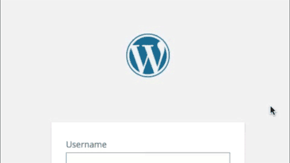

# Starter-Kit #
## WordPress Plugin Foundation ##

**Starter-Kit** is a development kit for rapidly building WordPress plugins, providing some useful
services and a clean way to structure a plugin.

## New in 0.9 ##

+   Starter-Kit now makes use of namespaces and reflection available in **PHP 5.3 or better**.
+   Streamlined Feature-based development process ("Drop-ins" are out ).
+   Classes extending Feature no longer need the init function.
+   All basic Starter-Kit behavior has been moved to separate classes and can be removed from
	the plugin if not needed.
+   Template and option services live in the Feature class/subclasses.
+   Nearly all boilerplate has been moved into the Kit or Feature classes and out of the way.
+   Added Grunt support
	+   SASS, autoprefixer and cssmin for CSS
	+   JavaScript inspected JSHint and compressed with Uglify
	+   Images compressed with imagemin
	+   Default grunt task and watch task "dev"
	+   npm install from package.json

### Feature-based Development ###

I can't speak for other developers, but when I build a plugin I want to think about
what the plugin does, the features I plan to build. I want to use OOP. I want a clean separation of my PHP
logic and HTML views. I want to start a project running with everything I need &emdash; then I never want to see it,
much less think about it, again. That's what this framework is designed to provide.

With Starter-Kit, you build Features &emdash; that is, small classes that extend from the framework's "Feature"
class &emdash; and drop them into one of three folders (admin, client, or core). These files are automatically loaded
in the correct context -- so you're only loading the functionality you need, when you need it.

Your classes aren't required to extend Feature, but doing so adds some useful services:
+   Auto-initializing static method for instantiating your feature from an action-hook.
+   A template class for separating your class's logic from HTML output.
+   WordPress-options handling methods, with values namespaced to your plugin.
+   Class-Friendly methods for adding actions &amp; filters to WordPress without array-wrapping.
+   WordPress AJAX methods wrapped for easy implementation.

In addition to auto-class loading, the base plugin itself:
+   handles default plugin options, with the ability to handle defaults between plugin versions.
+   adds an init hook for your plugin that triggers Feature initiation.
+   sets default template directory for your rendering
+   provides ready for use activation and deactivation hooks

And if that's not enough for you, the project comes ready for use with SASS, autoprefixer, jshint, uglify
and imagemin &emdash and of course it's just a starting point. Grunt being grunt means you can tweak it
to your heart's content.

## Getting Started with Starter-Kit ##

Starter-Kit is a template that you customize:

1.  Download Starter-Kit and copy the files to your development directory and rename
	'starter-kit.php' to the name of your plugin.
2.  In your development tool of choice, do a global find-and-replace:
	+   Replace all instances of the "irresponsible_art\starter_kit" namespace to reflect your organization
	+   Replace all instances of "StarterKit" to your class name.
	+   Replace all instances of "starter_kit" with your plugin's slug -- this will replace things like the
		WP text-domain, options key, and a few other strings.

If you plan to use grunt in your project:

1.  In a console, navigate to your development directory and run "npm install".
2.  In that same console, run "grunt" to test your build
3.  When you're ready to work, run the "grunt dev" to start the watch task ( ctrl + C stops it ).

## A Sample Feature ##

The framework comes with a sample feature already in the assets/core folder ("rebrand.php") which rebrands the
WordPress login screen and utilizes the majority of the frameworks features, if only in a basic way.

### Warning ###

The "rebrand" feature is not only one of the stupidest examples of a plugin known to man, it also goes
to near idiotic lengths to make use of SASS, JavaScript, Templates, action hooks, filters and even options.
No one in their right mind would use it.

That said, the animation is still kind cool to watch.




```php
function myplugin_rebrand_logo() {
	echo '<style type="text/css">
	h1 a { background-image: url(http://yourwebsite.com/wp-content/uploads/yourimage.jpg) !important; }
	</style>';
}
add_action( 'login_head' , 'myplugin_rebrand_logo' ) ;
```

Starter-Kit will find your file and apply the action.

### Creating an Object Oriented Drop-In ###

Simple drop-ins are all well and good, but Starter-Kit was built to work with classes and adds a few
methods to make working with classes in WordPress a little less confusing.

To start using the methods, create Drop-In class that inherits from the DropIn base class. Assume you renamed
starter_kit to 'xyzPlugin' and you wanted to build the re-branding piece above as a class:

```php
class xyzPlugin_Branding extends xyzPlugin_DropIn {

	public function init( $callable = array( ) ){
		if( is_callable( $callable ) && method_exists( $callable[ 0 ] , $callable[ 1 ] ) ){
			call_user_func_array( $callable , array( new self ) ) ;
		}
	}

	public function __construct( ){
		$this->add_action( 'login_head' , 'rebrand_logo' ) ;
	}

	public function rebrand_logo() {
		echo '<style type="text/css">
    	h1 a { background-image: url(http://yourwebsite.com/wp-content/uploads/yourimage.jpg) !important; }
    	</style>';
	}
} // END CLASS

// Subscribe to the drop-in to the initialization event
add_action( 'xyzPlugin_init' , array( 'xyzPlugin_Branding' , 'init'  ) ) ;
```

In the OOP version we add the action in the constructor which runs on the WordPress `plugins_loaded` action hook
and use `$this->add_action( )` instead of WordPress' `add_action`. Using `$this` "array-wraps" the method ( creating
a callable in PHP lingo ) so WordPress can find and call your method. There's also a $this->add_filter() method
as well -- both of which use the same parameter as the built-in WordPress methods.

The new code here contains a bit of boilerplate:
* The static init function creates the instance of the class.
* The add_action call on the last line of the drop-in file subscribes the class to the
initialization action generated by the plugin. Supply the name of your class as the first parameter of the array.

### Using the Template System ###

Starter-Kit includes a simple template system for helping you separate your rendering from your logic.
Sticking with the rebranding drop-in, we can create a template file that outputs the style tag:

```php
<style type="text/css">
	h1 a { background-image: url(<?php echo $url ; ?>) !important; }
</style>
```
and save that file as `login-icon-style.php` in the `__inc/templates/` folder. Now we can rebuild our Branding class:

```php
class xyzPlugin_Branding extends xyzPlugin_DropIn {

	public function init( $callable = array( ) ){
		if( is_callable( $callable ) && method_exists( $callable[ 0 ] , $callable[ 1 ] ) ){
			call_user_func_array( $callable , array( new self ) ) ;
		}
	}

	public function __construct( ){
		$this->add_action( 'login_head' , 'rebrand_logo' ) ;
	}

	public function rebrand_logo() {
		xyzPlugin::template->set( 'url' , 'http://yourwebsite.com/wp-content/uploads/yourimage.jpg' ) ;
		echo xyzPlugin::template->apply( 'login-icon-style.php' ) ;
	}
} // END CLASS

// Subscribe to the drop-in to the initialization event
add_action( 'xyzPlugin_init' , array( 'xyzPlugin_Branding' , 'init'  ) ) ;
```

### Options Handling ###

Our Branding drop-in is taking shape, but that static URL is a problem. Wouldn't it be better
to add this to the WordPress options for the plugin?

```php
class xyzPlugin_Branding extends xyzPlugin_DropIn {

	public function init( $callable = array( ) ){
		if( is_callable( $callable ) && method_exists( $callable[ 0 ] , $callable[ 1 ] ) ){
			call_user_func_array( $callable , array( new self ) ) ;
		}
	}

	public function __construct( ){
		$this->add_action( 'login_head' , 'rebrand_logo' ) ;
	}

	public function rebrand_logo() {
		xyzPlugin::template->set( 'url' , xyzPlugin::get_option( 'logo_url' , 'http://yourwebsite.com/wp-content/uploads/yourimage.jpg' ) ;
		echo xyzPlugin::template->apply( 'login-icon-style.php' ) ;
	}
} // END CLASS

// Subscribe to the drop-in to the initialization event
add_action( 'xyzPlugin_init' , array( 'xyzPlugin_Branding' , 'init'  ) ) ;
```

The static get_option method will attempt to fetch the option stored with the key 'logo_url' and return it.
If the value doesn't exist, it returns the second parameter.

#### Default Options ####

The main Starter-Kit class file contains a private method `defaults` that when you start returns an empty array.
This method is called when your plugin is initialized and will add the array of options you specify to the
WordPress options for your plugin. In this way, you know the options are always populated initially.

For our Branding drop-in, we could add the default url:

```php
[...]
private static function defaults( )
{
	return array(
		'logo_url' => 'http://yourwebsite.com/wp-content/uploads/yourimage.jpg'
	) ;
}

[...]
```

It's good practice, but there's an additional benefit to using this structure.

Say the next version of this plugin adds the ability to set the title element of the logo as well and you're
storing the title text in your options as well.

```php
[...]
private static function defaults( )
{
	return array(
		'logo_url'      => 'http://yourwebsite.com/wp-content/uploads/yourimage.jpg' ,
		'logo_title'    => 'My Awesome Company'
	) ;
}

[...]
```

By adding this entry to the defaults, Starter-Kit will be sure to sync the keys and values in
the returned by the `defaults` method with the existing plugins options, preserving the values
in stored by WordPress if they exist.

### AJAX Methods ####


